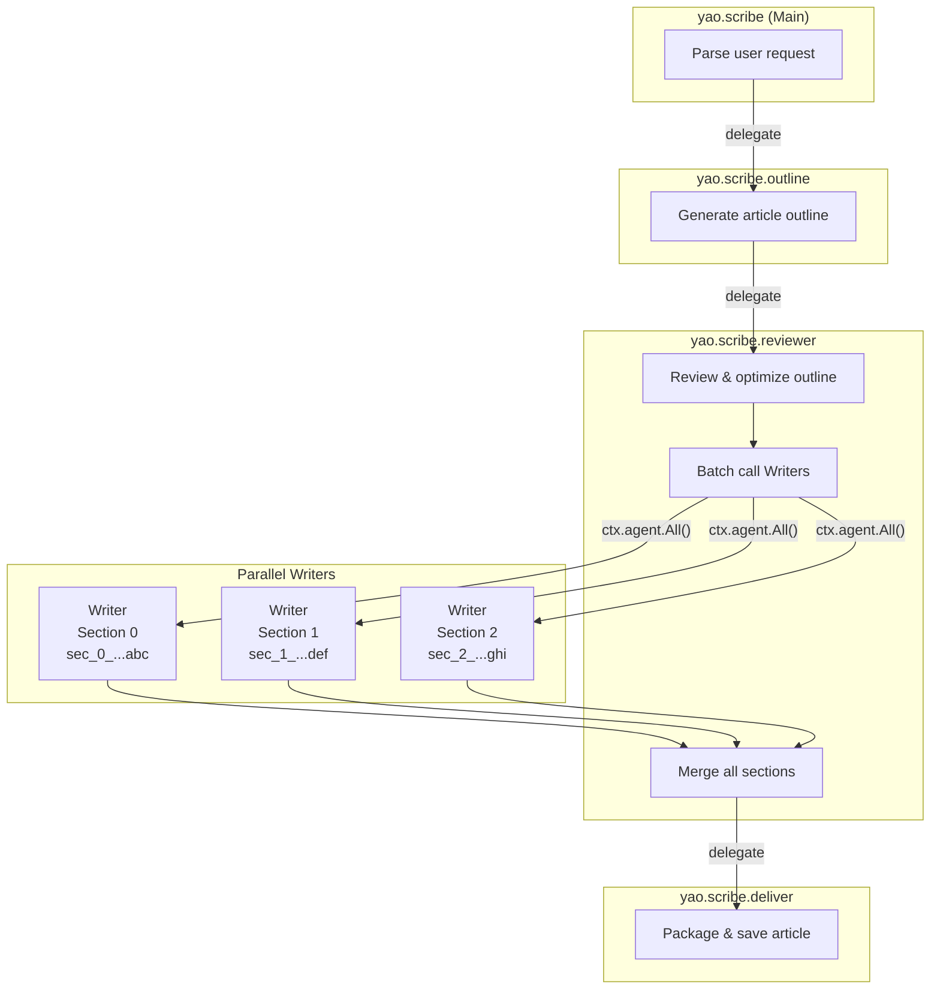
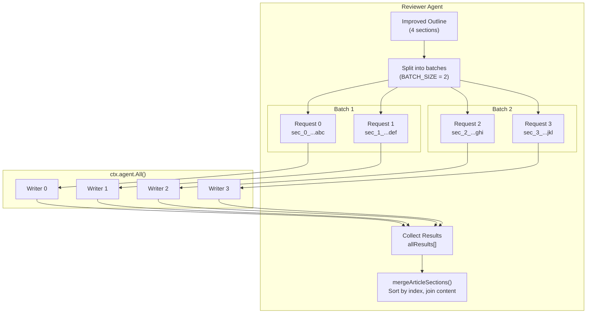
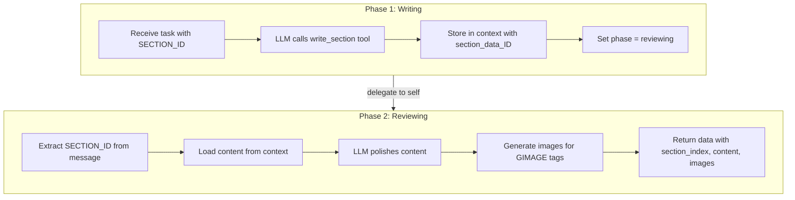

# Scribe - AI Article Writing Agent

An intelligent multi-agent system that generates high-quality articles with images through a coordinated pipeline.


**Development Status**

| AI Planning | AI Development | AI Testing | AI Review | Manual Review | Manual Testing |
|:-----------:|:--------------:|:----------:|:---------:|:-------------:|:--------------:|
| ✅ Done | ✅ Done | ✅ Done | ✅ Done | ✅ Done | ✅ Done |

**Availability**

| Downloadable | Installable | Manual Testable |
|:------------:|:-----------:|:---------------:|
| ✅ Yes | ✅ Yes | ✅ Yes |

## Quick Start

```bash
# Test with a simple prompt
yao agent test -n yao.scribe -i "Write a short article about coffee, 3 sections"

# Chinese
yao agent test -n yao.scribe -i "写一篇关于咖啡的短文，3个段落"

# Run unit tests
yao agent test -i scripts.yao.scribe.utils -v
```

## About This Example

This is a **reference implementation** demonstrating how to build complex multi-agent workflows in Yao. While it generates articles, the same patterns can be adapted for many other use cases:

- **Code Generation**: Replace Writers with code generators, Reviewer with code reviewer
- **Project Scaffolding**: Outline → file structure, Writers → individual file generators
- **Data Processing**: Split large datasets into batches, process in parallel, merge results
- **Report Generation**: Research → outline → parallel section writers → final report

The key patterns you can reuse:

| Pattern | What It Solves | How It Works |
|---------|---------------|--------------|
| **Delegate Chain** | Sequential multi-agent workflow | `Main → Outline → Reviewer → Deliver` |
| **Parallel Batch Processing** | Speed up repetitive tasks | `ctx.agent.All()` with batch splitting |
| **State Isolation** | Prevent parallel workers from colliding | Unique IDs as context keys |
| **Self-Delegation** | Multi-turn within single agent | `delegate` to same agent with state flag |
| **Tool-Driven Flow** | LLM decides when to proceed | Check tool results in `Next` hook |

## Architecture



## Parallel Processing & Merging

When Writers run in parallel batches, results are collected and merged by the Reviewer:



### Key Points

1. **Unique Section IDs**: Each request gets a unique ID (`sec_{index}_{timestamp}_{random}`) to isolate Writer state
2. **Order Preserved**: `ctx.agent.All()` returns results in request order; we use `expectedIndex` not returned index
3. **Merge by Index**: `mergeArticleSections()` sorts results by `section_index` and joins content with outline title

### How It Works

1. **Reviewer** generates unique ID for each section:
   ```typescript
   const sectionId = generateSectionId(sectionIndex);
   // → "sec_0_1706234567890_abc123"
   ```

2. **Message** includes ID for Writer to extract:
   ```
   [SECTION_ID: sec_0_1706234567890_abc123]
   [SECTION_INDEX: 0]
   
   Please write section 1 of the article...
   ```

3. **Writer** uses ID for state isolation:
   ```typescript
   const { id: sectionId } = extractSectionInfo(messages);
   const phaseKey = `writer_phase_${sectionId}`;
   const sectionKey = `section_data_${sectionId}`;
   ```

4. **Self-delegation** preserves ID:
   ```typescript
   // When Writer delegates to itself for review phase,
   // the section ID is included in the message
   return {
     delegate: {
       agent_id: "yao.scribe.writer",
       messages: [{
         role: "user",
         content: `[SECTION_ID: ${sectionId}]\n[SECTION_INDEX: ${sectionIndex}]\n\nPlease polish...`
       }]
     }
   };
   ```

## Writer Two-Phase Flow

Each Writer handles one section through a two-phase delegate pattern:



### Key Points

1. **Writing Phase**: LLM calls `write_section` tool, content stored with unique section ID
2. **Self-Delegation**: Writer delegates to itself with `[SECTION_ID]` preserved in message
3. **Reviewing Phase**: Extracts ID, loads stored content, polishes, generates images
4. **Final Return**: `{ data: { section_index, content, images } }` for Reviewer to merge

## File Structure

```
assistants/yao/scribe/
├── package.yao           # Main agent config
├── prompts.yml           # Main agent prompts
├── README.md             # This file
├── src/
│   ├── index.ts          # Main agent hooks
│   ├── tools.ts          # MCP tool implementations
│   ├── utils.ts          # Shared utilities
│   └── utils_test.ts     # Unit tests
├── mcps/
│   └── tools.mcp.yao     # MCP server config
├── outline/              # Outline sub-agent
├── reviewer/             # Reviewer sub-agent
├── writer/               # Writer sub-agent
└── deliver/              # Deliver sub-agent
```

## Key Functions

| Function | Location | Description |
|----------|----------|-------------|
| `generateSectionId(index)` | utils.ts | Generate unique ID for state isolation |
| `buildSectionTask(...)` | utils.ts | Build Writer task message with section ID |
| `extractSectionInfo(msgs)` | writer/index.ts | Extract section ID and index from message |
| `mergeArticleSections(...)` | utils.ts | Merge all section results by index order |
| `parseSectionResult(...)` | utils.ts | Parse Writer result from delegate chain |

## Configuration

### Outline Prompt Guidelines

The outline generator is configured to avoid AI-sounding patterns:

- **Titles**: Specific and evocative, not generic ("The Secret in Your Morning Cup" vs "Benefits of Coffee")
- **Sections**: No functional names like "Introduction", "Conclusion" - each section tells a story
- **Content**: Narrative threads, not knowledge checklists
- **Images**: Specific visual descriptions with lighting, mood, atmosphere

See `outline/prompts.yml` for full configuration.
